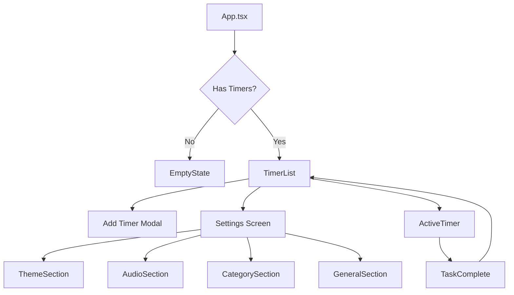

# TIMER_APP - Architecture Documentation

## Overview

The TIMER_APP is a React Native application built with Expo that provides a productivity-focused timer management system. Users can create, manage, and track timers with customizable themes, sounds, and categories.

---

## Technology Stack

| Technology | Purpose |
|------------|---------|
| **React Native** | Cross-platform mobile framework |
| **Expo (SDK 54)** | Development platform and build tools |
| **TypeScript** | Type-safe JavaScript |
| **AsyncStorage** | Local data persistence |
| **expo-av** | Audio playback for timer completion sounds |
| **expo-notifications** | Background timer notifications |
| **expo-linear-gradient** | UI gradient effects |
| **expo-blur** | Glassmorphism UI effects |
| **expo-keep-awake** | Prevent screen sleep during active timers |

---

## Project Structure

```
TIMER_APP/
├── App.tsx                     # Main application entry point
├── app.json                    # Expo configuration
├── package.json                # Dependencies
├── tsconfig.json               # TypeScript configuration
└── src/
    ├── components/             # Shared UI components
    ├── constants/              # App-wide constants and data types
    ├── screens/Timer/          # All timer-related screens (modular)
    └── utils/                  # Utility functions
```

---

## Directory Details

### `src/components/` - Shared Components

| File | Description |
|------|-------------|
| [AddTimerModal.tsx](file:///Users/abhisheksingh/Desktop/project/TIMER_APP/src/components/AddTimerModal.tsx) | Modal for creating/editing timers with wheel pickers for hours, minutes, seconds |
| [DeleteModal.tsx](file:///Users/abhisheksingh/Desktop/project/TIMER_APP/src/components/DeleteModal.tsx) | Confirmation modal for deleting or resetting timers |
| [SlideToComplete.tsx](file:///Users/abhisheksingh/Desktop/project/TIMER_APP/src/components/SlideToComplete.tsx) | Swipe gesture component to complete timers early |

---

### `src/constants/` - Constants & Types

| File | Description |
|------|-------------|
| [data.ts](file:///Users/abhisheksingh/Desktop/project/TIMER_APP/src/constants/data.ts) | Type definitions (`Timer`, `Category`), default categories, color presets, sound options, landscape theme presets |

---

### `src/utils/` - Utility Functions

| File | Description |
|------|-------------|
| [storage.ts](file:///Users/abhisheksingh/Desktop/project/TIMER_APP/src/utils/storage.ts) | AsyncStorage helpers for loading/saving timers |
| [backgroundTimer.ts](file:///Users/abhisheksingh/Desktop/project/TIMER_APP/src/utils/backgroundTimer.ts) | Notification scheduling for background timer completion |

---

### `src/screens/Timer/` - Timer Feature Screens (Modular)

```
Timer/
├── Settings/                   # Settings screen module
│   ├── index.tsx               # Main settings orchestrator
│   ├── ThemeSection.tsx        # Color customization with live preview
│   ├── AudioSection.tsx        # Sound selection & repetition
│   ├── CategorySection.tsx     # Category CRUD operations
│   ├── GeneralSection.tsx      # General settings (disable past timers)
│   ├── InfoSection.tsx         # App version info
│   ├── types.ts                # Shared types, interfaces, constants
│   └── styles.ts               # All settings-related styles
├── TimerList/                  # Timer listing screen module
│   ├── index.tsx               # Main timer list with calendar, analytics, filters, Timer/Task toggle
│   └── utils/
│       └── timeUtils.ts        # Time parsing & formatting utilities
├── Task/                       # Task management module (NEW)
│   └── index.tsx               # Task list with similar design to TimerList
├── ActivityTimer/              # Active timer screen
│   └── index.tsx               # Running timer with progress, controls, borrow time
├── EmptyState/                 # Empty state screen
│   └── index.tsx               # Displayed when no timers exist
├── TaskComplete/               # Completion screen
│   └── index.tsx               # Timer completion summary with extend options
└── LandingPage/                # Future onboarding
    └── index.tsx               # Placeholder for future landing screen
```

---

## Data Models

### Timer Interface
```typescript
interface Timer {
    id: number;
    title: string;
    time: string;              // Current remaining time (HH:MM:SS)
    total: string;             // Original total time
    status: 'Upcoming' | 'Running' | 'Paused' | 'Completed';
    tier: number;
    forDate?: string;          // Date (YYYY-MM-DD) timer belongs to
    categoryId?: string;
    borrowedTime?: number;     // Extra time added (seconds)
    borrowedTimeList?: number[];
    savedTime?: number;        // Time saved if completed early
    completedPercentage?: number;
    startTime?: string;        // ISO timestamp when started
    startedTimestamp?: number; // Unix timestamp for background calculation
    remainingSecondsAtStart?: number;
    notificationId?: string;
    isAcknowledged?: boolean;  // Completion acknowledged by user
    createdAt?: string;
    updatedAt?: string;
}
```

### Category Interface
```typescript
interface Category {
    id: string;
    name: string;
    color: string;            // Hex color code
    icon: MaterialIcons key;   // Icon name from @expo/vector-icons
}
```

---

## App Flow



---

## State Management

The app uses React's `useState` and `useEffect` hooks for state management in `App.tsx`:

| State | Purpose |
|-------|---------|
| `timers` | Array of all Timer objects |
| `activeTimer` | Currently selected/running timer |
| `currentScreen` | Navigation state ('list', 'active', 'complete', 'settings') |
| `selectedDate` | Calendar date filter |
| `categories` | User-defined categories |
| `fillerColor`, `sliderButtonColor`, `timerTextColor` | Theme colors |
| `selectedSound`, `soundRepetition` | Audio settings |

---

## Key Features

1. **Timer Management**: Create, edit, delete, start, pause, complete timers
2. **Date-Based Organization**: View timers by specific dates via calendar
3. **Category System**: Organize timers with custom categories (icon + color)
4. **Theme Customization**: Live preview with swipeable presets
5. **Sound Settings**: Completion sounds with configurable repetition
6. **Time Borrowing**: Extend running or completed timers
7. **Background Notifications**: Alert when timers complete in background
8. **Responsive Layout**: Portrait and landscape mode support

---

## AsyncStorage Keys

| Key | Purpose |
|-----|---------|
| `@timer_app_timers` | Stored timers array |
| `@timer_filler_color` | Theme filler color |
| `@timer_slider_button_color` | Button/slider color |
| `@timer_text_color` | Timer text color |
| `@timer_active_preset_index` | Selected theme preset |
| `@timer_completion_sound` | Selected sound index |
| `@timer_sound_repetition` | Sound repeat count |
| `@timer_enable_past` | Disable past timers toggle |
| `@timer_categories` | User categories array |
| `@timer_active_id` | ID of active timer (for cold start) |

---

## Future Expansion

The modular `src/screens/Timer/` structure is designed to support additional features:

- **Task Feature**: `src/screens/Task/` - Todo-style task management
- **Activity Feature**: `src/screens/Activity/` - Activity tracking/logging
- **Reports Feature**: Detailed analytics and productivity reports

Each new feature would follow the same modular pattern with its own subdirectories for components, hooks, utils, and styles.
