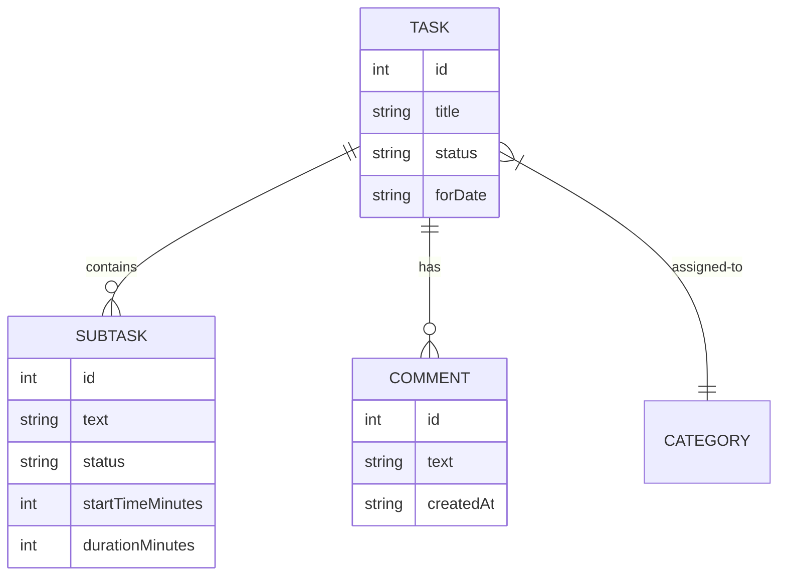

# 📝 Task & Subtask Storage Guide

This document explains the technical implementation and storage structure of **Tasks** and **Subtasks** (Stages) in the application.

---

## 🏗️ Core Storage Model
Tasks are stored in a single JSON array under the key `@timer_app_tasks` in `AsyncStorage`.

### 1. Task Object
The top-level entity representing a main objective.

```typescript
interface Task {
  id: number;                // Unique ID (Date.now())
  title: string;             // Task name
  description?: string;      // Optional details
  status: 'Pending' | 'In Progress' | 'Completed';
  priority: 'Low' | 'Medium' | 'High';
  categoryId?: string;       // ID from @timer_categories
  forDate: string;           // YYYY-MM-DD (Key for calendar filtering)
  isBacklog?: boolean;       // If true, appears in backlog view
  createdAt: string;         // ISO timestamp
  updatedAt: string;         // ISO timestamp
  comments?: Comment[];      // Array of user notes (see below)
  stages?: TaskStage[];      // Array of subtasks (see below)
  isPinned?: boolean;        // Pinned to top of list
}
```

---

## 🌲 Subtask Implementation (`TaskStage`)
Subtasks are stored as a nested array within each task. They use a **4-state status** system and **time-based layout data**.

### Status Workflow
- `Upcoming`: Not yet started.
- `Process`: Currently being worked on.
- `Done`: Successfully completed.
- `Undone`: Mark as not finished or skipped.

### Structural Detail
```typescript
interface TaskStage {
  id: number;                // Unique ID (Date.now())
  text: string;              // Subtask description
  status: StageStatus;       // Upcoming | Process | Done | Undone
  isCompleted: boolean;      // Legacy flag (mapped: Done=true)
  createdAt: string;         // ISO timestamp
  
  // Layout Data (Used for Timeline View)
  startTimeMinutes?: number; // Minutes from 00:00 (e.g., 540 for 9:00 AM)
  durationMinutes?: number;  // Length in minutes (e.g., 30)
  endTimeMinutes?: number;   // startTimeMinutes + durationMinutes
  
  // Work Tracking
  startTime?: string;        // ISO string when transitioned to 'Process'
  endTime?: string;          // ISO string when transitioned to 'Done'
}
```

---

## 💬 Comments & Interactions
Each task maintains a list of user-added comments.

```typescript
interface Comment {
  id: number;
  text: string;
  createdAt: string; // ISO string
}
```

---

## 🔄 Data Relationship Diagram



---

## 💾 Storage Operations
- **Save**: The whole task array is stringified and overwritten on any change (add, edit, delete, toggle).
- **Load**: Retrieved once on app launch and managed in global state (`App.tsx`).
- **Filtering**: Screen logic filters the array based on `forDate` matching the selected date in the calendar.
